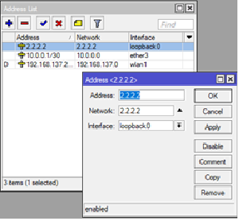

# MikroTik - monitoring RIP 
monitorovanie siete RIP a zasielanie informácii na e-mail
## Nadstavenie smerovačov
### nadstavenie rozhraní
Je treba priradiť jednotlivým rozhraniam IP adresy.  
Takéto nadstavenie je vo Winboxe v záložke IP>addresses

