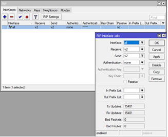
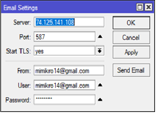
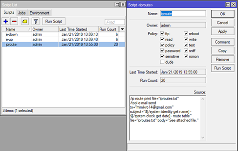
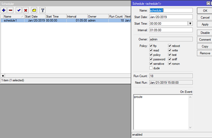
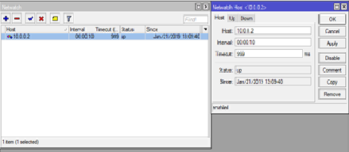

# MikroTik - monitoring RIP 
monitorovanie siete RIP a zasielanie informácii na e-mail
## Nadstavenie smerovačov
### nadstavenie rozhraní
Je treba priradiť jednotlivým rozhraniam IP adresy.  
Takéto nadstavenie je vo Winboxe v záložke IP>addresses  

### nadstavenie RIP
Je treba spustiť dynamické smerovanie protokolom RIP  
Takéto nadstavenie je vo Winboxe v záložke routing>RIP  

### nadstavenie e-mail
následne je vo Winboxe treba nadstavit emailovu adresu pre zasielanie emailov  

## Konfigurácia skriptov
skript na skopírovanie smerovacej tabulky a zaslanie na email

## Konfigurácia schedulera
nadstavíme scheduler ktorý bude volať skript v pravidelných intervaloch  
  
scheduler sa dá prípadne nadstavit pomocou terminálu príkazom  
/system scheduler  
add on-event="iproute" start-time=00:00:00 interval=1h  
## Konfigurácia netwatch
nadstavíme netwatch ktorý bude kontrolovat stav linky a v prípade zmeny stavu zavolá príslušný skript  
  
netwatch sa dá prípadne nadstavit pomocou terminálu príkazom  
system netwatch> add host=10.0.0.2 timeout=999ms interval=20s up-script=e-up down-script=e-down  
**skript ktorý netwatch zavolá**  
system script> add name=e-down source={/tool e-mail send toto=mimikro14@gmail.com subject="stav linky" body="linka dolu"}  
